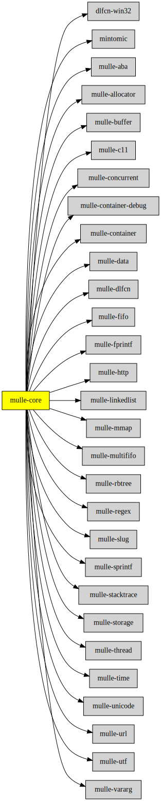

# mulle-core

#### 🌋 Almagamated library of mulle-core + mulle-concurrent + mulle-c

This is an almagamation of the [mulle-core](//github.com/mulle-core),
[mulle-concurrent](//github.com/mulle-concurrent),
[mulle-c](//github.com/mulle-c) projects that need not be forced linked. See
the [constituting projects](#Constituents) for documentation, bug reports,
pull requests.

The advantages of using **mulle-core** are:

* compiles faster than two dozens of individual projects
* you only need to link against one library file
* `#include` statements may remain unchanged or simplify to `#include <mulle-core/mulle-core.h>`


## Linking with mulle-atinit/mulle-atexit

This library does not include [mulle-atinit](//github.com/mulle-core/mulle-atinit)
and [mulle-atexit](//github.com/mulle-core/mulle-atexit) and
[mulle-testallocator](//github.com/mulle-core/mulle-testallocator). *mulle-atinit*
and *mulle-atexit* need special linker flags and  *mulle-testallocator* depends
on *mulle-atinit* directly. As a "customer" of *mulle-atinit* or *mulle-atexit*,
that need not concern you, as the newer versions of both projects are recognizant of the fact, that mulle-core exists and that it may contain their dependencies.

### Under the hood

*mulle-atinit* needs to be linked with *mulle-thread* and *mulle-dlfcn*.
But both are part of *mulle-core*. *mulle-atinit* is and can not be part of
*mulle-core*. It needs to specify *mulle-core* as an alias preference over
*mulle-thread* and *mulle-dlfcn*. An existing *mulle-core* is now used for
linking in favor of *mulle-thread*, but *mulle-thread* is kept as a fallback.
If that wasn't done, you'd get duplicate symbol warnings from the linker.

The `mulle-sde dependency list` output of *mulle-atinit* should look like this:

```
address       supermarks     aliases                  include
-------       ----------     -------                  -------
mulle-thread  C,TreePrivate  mulle-core,mulle-thread
mulle-dlfcn   C,TreePrivate  mulle-core,mulle-dlfcn
```

*mulle-core* is now searched for in preference over *mulle-thread* and
*mulle-dlfcn*.
Because of `TreePrivate` any "benefactor" of *mulle-atinit*, will not fetch or
build *mulle-thread* or *mulle-dlfcn*.

### You are here




## Constituents

Add another constituent to the amalgamation with:

``` bash
mulle-sde dependency add --amalgamated \
                         --fetchoptions "clibmode=copy" \
                         --address src/mulle-container-debug \
                         clib:mulle-c/mulle-container-debug
```

Then edit `mulle-core.h` and add the envelope header to the others.


| Constituent                                  | Description
|----------------------------------------------|-----------------------
| [mulle-allocator](https://github.com/mulle-c/mulle-allocator) | 🔄 Flexible C memory allocation scheme
| [mulle-buffer](https://github.com/mulle-c/mulle-buffer) | ↗️ A growable C char array and also a stream
| [mulle-c11](https://github.com/mulle-c/mulle-c11) | 🔀 Cross-platform C compiler glue (and some cpp conveniences)
| [mulle-container](https://github.com/mulle-c/mulle-container) | 🛄 Arrays, hashtables and a queue
| [mulle-data](https://github.com/mulle-c/mulle-data) | #️⃣ A collection of hash functions
| [mulle-http](https://github.com/mulle-c/mulle-http) | 🈚 http URL parser
| [mulle-rbtree](https://github.com/mulle-c/mulle-rbtree) | 🍫 mulle-rbtree organizes data in a red/black tree
| [mulle-regex](https://github.com/mulle-c/mulle-regex) | 📣 Unicode regex library
| [mulle-slug](https://github.com/mulle-c/mulle-slug) | 🐌 Creates URL slugs
| [mulle-storage](https://github.com/mulle-c/mulle-storage) | 🛅 Memory management for tree nodes
| [mulle-unicode](https://github.com/mulle-c/mulle-unicode) | 🈚 Unicode ctype like library
| [mulle-url](https://github.com/mulle-c/mulle-url) | 🈷️ Support for URL parsing
| [mulle-utf](https://github.com/mulle-c/mulle-utf) | 🔤 UTF8-16-32 analysis and manipulation library
| [mulle-vararg](https://github.com/mulle-c/mulle-vararg) | ⏪ Access variable arguments in struct layout fashion in C
| [mintomic](https://github.com/mulle-concurrent/mintomic) | For more information, see [the documentation](http://mintomic.github.io/) or the accompanying blog post, [Introducing Mintomic](http://preshing.com/20130505/introducing-mintomic-a-small-portable-lock-free-api).
| [mulle-aba](https://github.com/mulle-concurrent/mulle-aba) | 🚮 A lock-free, cross-platform solution to the ABA problem
| [mulle-concurrent](https://github.com/mulle-concurrent/mulle-concurrent) | 📶 A lock- and wait-free hashtable (and an array too), written in C
| [mulle-fifo](https://github.com/mulle-concurrent/mulle-fifo) | 🐍 mulle-fifo fixed sized producer/consumer FIFOs holding `void *`
| [mulle-linkedlist](https://github.com/mulle-concurrent/mulle-linkedlist) | 🔂 mulle-linkedlist a wait and lock-free linked list
| [mulle-multififo](https://github.com/mulle-concurrent/mulle-multififo) | 🐛 mulle-multififo multi-producer/multi-consumer FIFO holding `void *`
| [mulle-thread](https://github.com/mulle-concurrent/mulle-thread) | 🔠 Cross-platform thread/mutex/tss/atomic operations in C
| [mulle-dlfcn](https://github.com/mulle-core/mulle-dlfcn) | ♿️ Shared library helper
| [mulle-fprintf](https://github.com/mulle-core/mulle-fprintf) | 🔢 mulle-fprintf marries mulle-sprintf to stdio.h
| [mulle-mmap](https://github.com/mulle-core/mulle-mmap) | 🇧🇿 Memory mapped file access
| [mulle-sprintf](https://github.com/mulle-core/mulle-sprintf) | 🔢 An extensible sprintf function supporting stdarg and mulle-vararg
| [mulle-stacktrace](https://github.com/mulle-core/mulle-stacktrace) | 👣 Stracktrace support for various OS
| [mulle-time](https://github.com/mulle-core/mulle-time) | 🕕 Simple time types with arithmetic on timespec and timeval


## Add

Use [mulle-sde](//github.com/mulle-sde) to add mulle-core to your project:

``` sh
mulle-sde add github:mulle-core/mulle-core
```

## Install

### Install with mulle-sde

Use [mulle-sde](//github.com/mulle-sde) to build and install mulle-core and all dependencies:

``` sh
mulle-sde install --prefix /usr/local \
   https://github.com/mulle-core/mulle-core/archive/latest.tar.gz
```

### Manual Installation

Download the latest [tar](https://github.com/mulle-core/mulle-core/archive/refs/tags/latest.tar.gz) or [zip](https://github.com/mulle-core/mulle-core/archive/refs/tags/latest.zip) archive and unpack it. Then install
**mulle-core** into `/usr/local` with [cmake](https://cmake.org):

``` sh
cmake -B build \
      -DCMAKE_INSTALL_PREFIX=/usr/local \
      -DCMAKE_PREFIX_PATH=/usr/local \
      -DCMAKE_BUILD_TYPE=Release &&
cmake --build build --config Release &&
cmake --install build --config Release
```


## Author

[Nat!](https://mulle-kybernetik.com/weblog) for Mulle kybernetiK  


